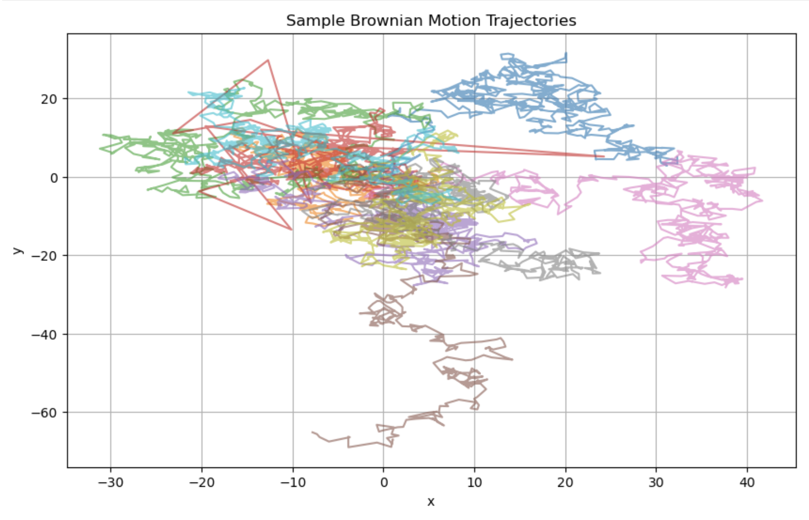
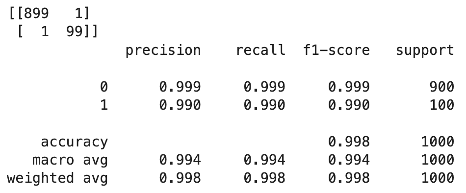

# Brownian Motion Anomaly Detection

This project uses unsupervised machine learning to detect and visualize anomalies in simulated Brownian motion trajectories. Anomalies are introduced as noise bursts in selected particles' paths. The pipeline applies feature engineering, Isolation Forest for anomaly detection, and animated visualization of trajectory data with local anomaly highlights.

## Example of Brownian Motion

## Project Structure
- **Data Simulation**: 2D Brownian motion for 1000 particles over 500 time steps
- **Anomaly Injection**: Spike anomalies in 10% of particles
- **Feature Engineering**: Compute speed and acceleration for each particle
- **Unsupervised Learning**: Isolation Forest to classify anomalous trajectories
- **Evaluation**: Compare predicted vs. true anomalies using precision/recall
- **Visualization**: Animated plot with real-time trajectory drawing and anomaly highlights

## Example Output
### Evaluation Report
Achieved near perfect classification with:

### Animation (GIF)

Red segments indicate local anomalous behavior (e.g., sudden velocity spikes).

## Technologies Used
- Python, NumPy, Pandas
- Scikit-Learn (IsolationForest)
- Matplotlib (animation)
- Jupyter Notebook
